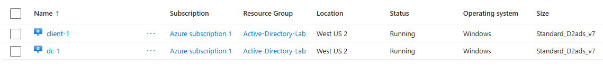
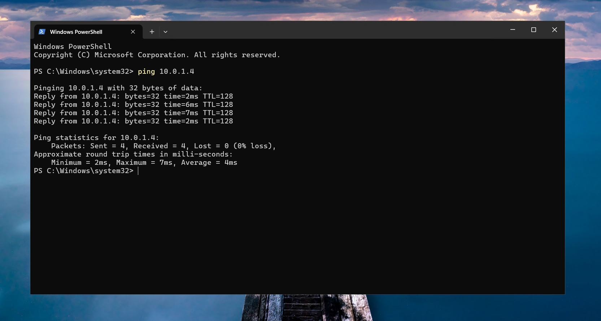
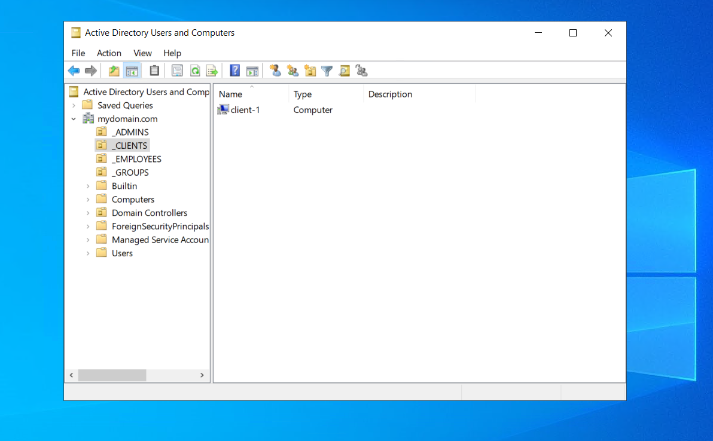
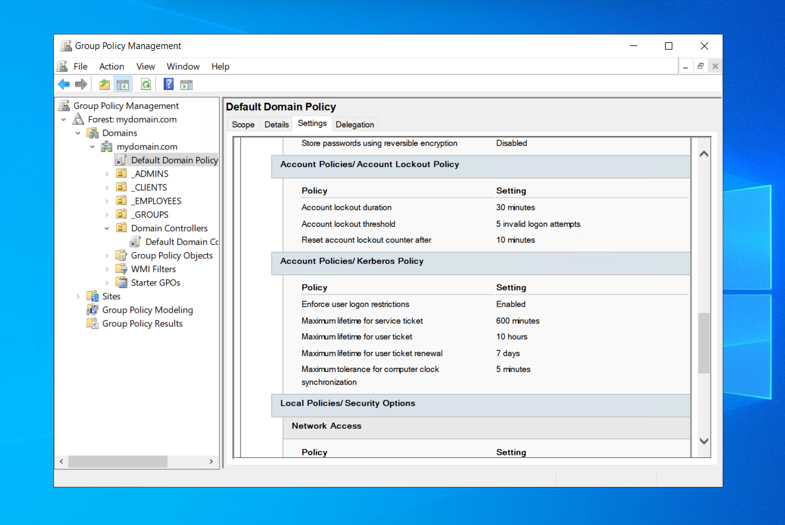
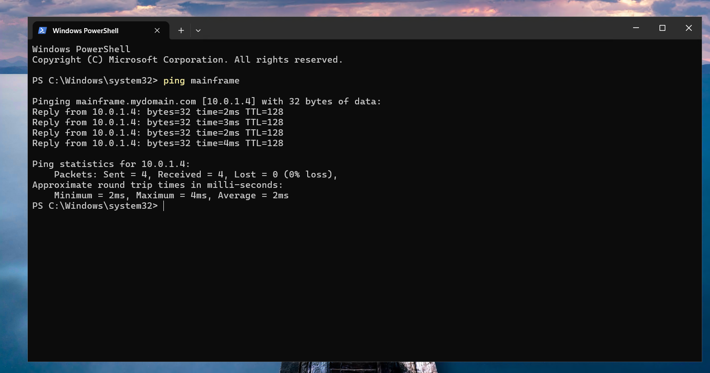
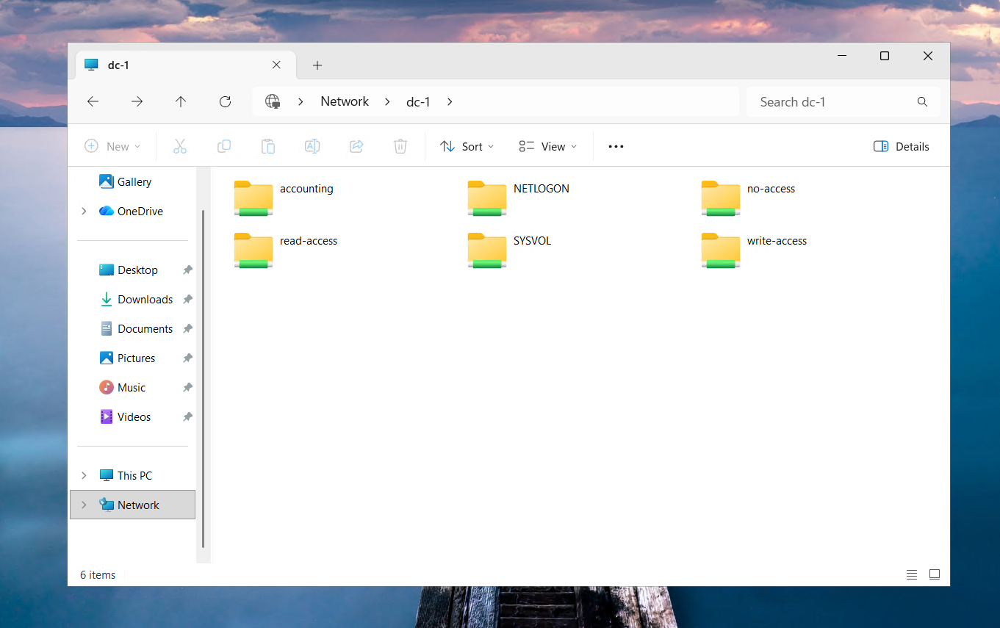
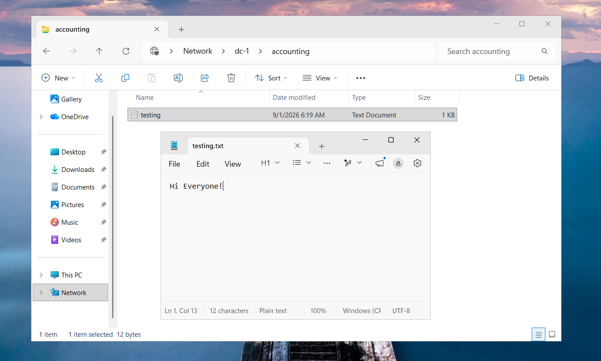

# 🖥️ Windows Active Directory & IT Administration

A hands-on Windows enterprise environment built in **Microsoft Azure** to practice **Active Directory administration, Windows Server management, DNS, Group Policy, user support, and network resource access**.

---

## 🎯 Project Overview

This project simulates a small Windows business environment using a **Windows Server 2022 domain controller** and a **Windows 11 Pro client workstation** hosted in Microsoft Azure.

I built and administered the environment to practice common IT support responsibilities, including **managing domain users and computers, configuring account security policies, troubleshooting DNS and authentication issues, and controlling access to shared network resources**.

The project demonstrates how core Windows services work together to centrally manage users, computers, security, and resources within an Active Directory domain.

---

## 🏗️ Environment & Technologies

The environment consists of two Azure virtual machines connected through the same virtual network:

```text
                       Microsoft Azure
                             │
                  Active-Directory-VNet
                             │
               ┌─────────────┴─────────────┐
               │                           │
             DC-1                      CLIENT-1
      Windows Server 2022             Windows 11 Pro
               │                           │
       Domain Controller              Domain Workstation
       Static Private IP                    │
               │                           │
               ├───── mydomain.com ───────┤
               │                           │
               ▼                           ▼
      Active Directory              Domain Authentication
      DNS                           DNS Resolution
      Group Policy                  Policy Testing
      Network Shares                Resource Access
```

| Area | Technology |
| --- | --- |
| **Cloud Platform** | Microsoft Azure |
| **Server** | Windows Server 2022 |
| **Client** | Windows 11 Pro |
| **Directory Services** | Active Directory Domain Services |
| **Networking** | TCP/IP, Azure Virtual Network, DNS |
| **Policy Management** | Group Policy |
| **Administration** | ADUC, DNS Manager, Event Viewer |
| **Command Line** | PowerShell |
| **Remote Access** | Remote Desktop |



> **Environment:** Windows Server and Windows 11 virtual machines deployed in Microsoft Azure.

---

## ☁️ Azure Infrastructure & Networking

I created the `Active-Directory-Lab` resource group and `Active-Directory-VNet`, then deployed:

- 🖥️ **dc-1** — Windows Server 2022 domain controller
- 💻 **client-1** — Windows 11 Pro client workstation

I configured `dc-1` with the static private IP address `10.0.1.4` and configured `client-1` to use the domain controller as its DNS server.

From `client-1`, I verified the DNS configuration with `ipconfig /all` and tested connectivity to the server:

```powershell
ping 10.0.1.4
```

The test returned four successful replies with **0% packet loss**, confirming communication between the workstation and server.



> **Connectivity verification:** `client-1` successfully communicating with `dc-1` across the Azure virtual network.

> ⚠️ **Lab Note:** Windows Firewall profiles on `dc-1` were temporarily disabled as part of the isolated training environment. In a production environment, required traffic should instead be permitted through appropriately scoped firewall rules.

---

## 🏢 Active Directory & User Administration

After establishing network connectivity, I installed **Active Directory Domain Services (AD DS)** on `dc-1` and promoted the server to a domain controller for:

```text
mydomain.com
```

Using **Active Directory Users and Computers (ADUC)**, I organized domain resources into dedicated organizational units:

```text
mydomain.com
│
├── _ADMINS
├── _EMPLOYEES
├── _CLIENTS
│     └── client-1
└── _GROUPS
```

I created a dedicated domain administrator account, joined `client-1` to the domain, and moved the workstation into the `_CLIENTS` OU.

I also executed a **provided PowerShell provisioning script** to generate employee accounts and practiced common Active Directory support tasks:

- 👤 Managing domain users
- 🔑 Resetting passwords
- 🔓 Unlocking accounts
- 🚫 Disabling and re-enabling accounts
- 👥 Managing security group membership
- 💻 Authenticating domain users from `client-1`
- 🔎 Reviewing security events with Event Viewer

I validated domain authentication from the workstation using `whoami` to confirm the active domain identity.



> **Active Directory:** Domain resources organized into administrative, employee, client, and security group organizational units.

---

## 🔐 Group Policy & Account Security

I used **Group Policy Management** to configure and test a centralized account lockout policy for domain users.

| Setting | Configuration |
| --- | --- |
| **Account Lockout Threshold** | 5 invalid logon attempts |
| **Account Lockout Duration** | 30 minutes |
| **Reset Lockout Counter After** | 10 minutes |

I applied the updated policy to `client-1` using:

```powershell
gpupdate /force
```

To validate the policy, I intentionally exceeded the failed-login threshold with a test employee account and confirmed that the account became locked.

I then located the affected account in Active Directory, unlocked it, and successfully authenticated again from `client-1`.

```text
Failed Login Attempts
        │
        ▼
  Account Locked
        │
        ▼
  Identify User in AD
        │
        ▼
   Unlock Account
        │
        ▼
  Verify User Login ✓
```



> **Account security:** Domain account lockout policy configured and tested through Group Policy.

---

## 🌐 DNS & Name Resolution

With `dc-1` providing DNS services, I practiced configuring and troubleshooting **Windows DNS name resolution** from the domain workstation.

Initially, `client-1` could not resolve:

```powershell
ping mainframe
```

Using DNS Manager on `dc-1`, I created an **A record** mapping:

```text
mainframe → 10.0.1.4
```

After creating the record, `client-1` successfully resolved `mainframe.mydomain.com` to `10.0.1.4`.

During testing, I also cleared the local DNS resolver cache using:

```powershell
ipconfig /flushdns
```

I additionally created and tested a **CNAME alias**:

```text
search → www.google.com
```



> **DNS verification:** `client-1` successfully resolving `mainframe.mydomain.com` to `10.0.1.4` through the DNS service running on `dc-1`.

This provided hands-on practice with a basic DNS troubleshooting workflow:

**Name fails to resolve → check DNS → configure record → retest → verify resolution.**

---

## 📁 File Shares & Access Control

I configured network shares on `dc-1` and tested access from domain users on `client-1`.

| Resource | Authorized Users / Group | Access |
| --- | --- | --- |
| `read-access` | Domain Users | Read |
| `write-access` | Domain Users | Read/Write |
| `no-access` | Domain Admins | Read/Write |
| `accounting` | ACCOUNTANTS | Read/Write |

From `client-1`, I connected to:

```text
\\dc-1
```

I verified that an employee could read but not create files in `read-access`, create files in `write-access`, and was denied access to the restricted `no-access` resource.



> **Network shares:** Shared resources hosted on `dc-1` and accessed from the domain workstation.

### 👥 Group-Based Resource Access

I created an Active Directory security group named `ACCOUNTANTS` and configured the `accounting` resource for members of that group.

A test employee initially could not access the Accounting resource because the account was not a member of `ACCOUNTANTS`.

After adding the employee to the security group and signing out and back into `client-1`, the employee successfully accessed the share and created and edited a test file.

```text
Employee
   │
   ▼
ACCOUNTANTS
   │
   ▼
Accounting Share
   │
   ▼
Read / Write Access ✓
```



> **Access verification:** An authorized employee successfully creating and editing a file within the Accounting network share.

This simulated a common IT support scenario where an employee's access to a department resource is controlled through **Active Directory security group membership**.

---

## 💡 Key Takeaways

This project gave me hands-on experience administering and troubleshooting a **Windows Active Directory domain** from both the administrator and employee perspectives.

Through the environment, I practiced:

- 🏢 Active Directory user, computer, OU, and group administration
- 🔐 Group Policy configuration and account lockout troubleshooting
- 🌐 DNS configuration and name resolution troubleshooting
- 📁 Network file sharing and access control
- 👥 Security group-based resource access
- ☁️ Windows Server and client administration in Microsoft Azure
- 🛠️ Common user support tasks such as password resets, account unlocks, and access troubleshooting

Most importantly, the project connected these technologies into one environment and demonstrated how **identity, authentication, networking, security policies, DNS, and resource permissions work together to support users in a Windows domain**.

### 📚 Project Context

This project was completed as part of hands-on **CourseCareers IT training** and documented as a portfolio project to demonstrate the technical skills and troubleshooting workflows I practiced.

The environment is an **educational lab** designed to simulate common Windows IT administration and support responsibilities rather than a production deployment.
